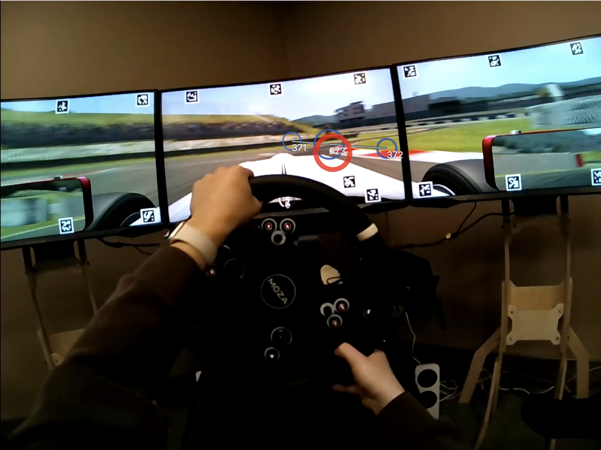
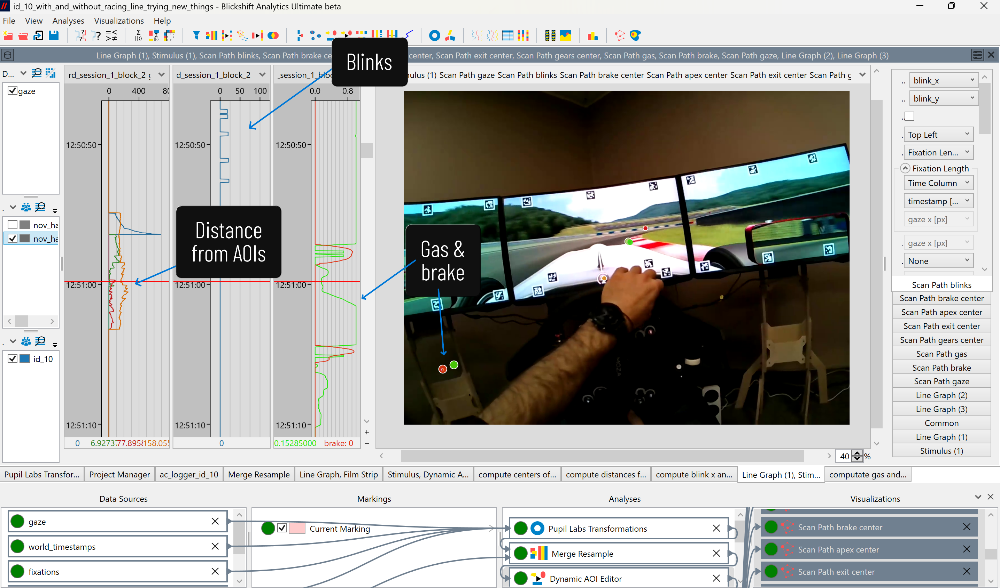

::: {.content-section}

Explore our lab, research activities, and team events.

::: {.gallery-grid}

::: {.gallery-item}
{fig-alt="Racing simulator setup"}

::: {.gallery-caption}
Our racing simulator setup
:::

:::

::: {.gallery-item}
{fig-alt="Racing simulator setup, close-up view"}

::: {.gallery-caption}
Our racing simulator setup
:::

:::

::: {.gallery-item}
{fig-alt="Driving in the simulator with eye tracking"}

::: {.gallery-caption}
Driving in the simulator with eye tracking
:::

:::

::: {.gallery-item}
{fig-alt="Blickshift Analytics gaze analysis software"}

::: {.gallery-caption}
Blickshift Analytics gaze analysis software
:::

:::

::: {.gallery-item}

:::

::: {.gallery-item}


::: {.gallery-caption}
Race car telemetry & gaze analysis in Blickshift Analytics
:::

:::

:::

:::
