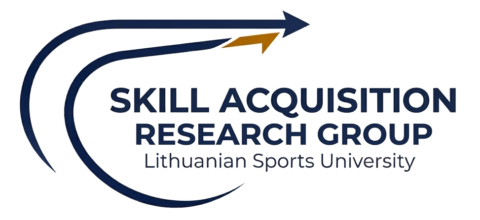
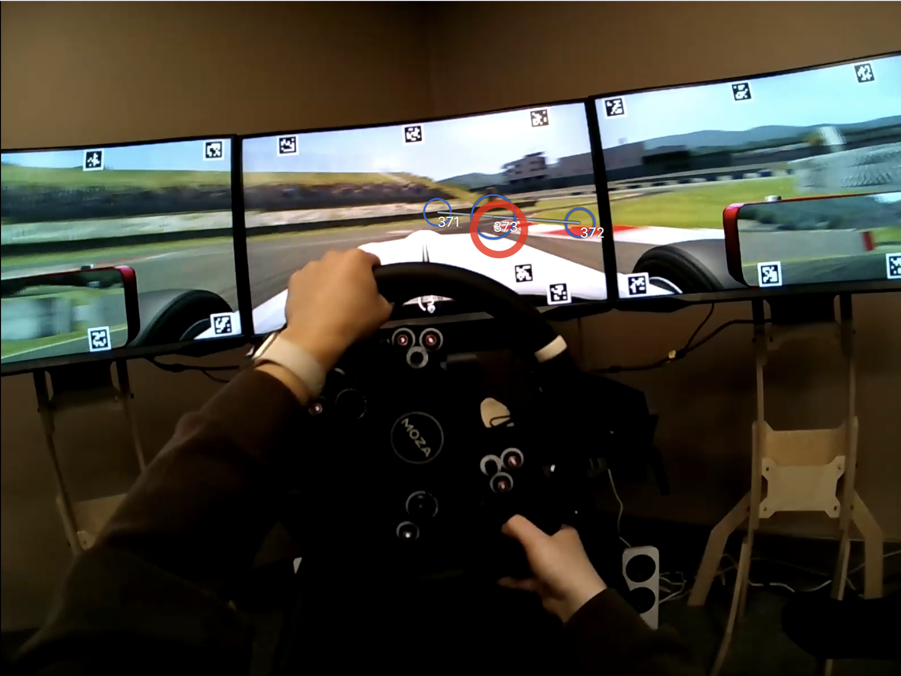

::: {.page-hero}

::: {.hero-subtitle}
Advancing understanding of motor learning and skill acquisition
:::
:::

::: {.content-section}

## Welcome

Welcome to our skill acquisition research group. We study how humans learn complex, often sport-related motor skills. Specifically, our research group is interested in the relationship between eye movements and performance and learning in complex tasks that require rapid information processing. We use a racecar driving simulator to examine how novices can learn a difficult perceptual-motor task based on various learning theories.

## Our Research

<i class="bi bi-graph-up-arrow"></i>

### Skill Acquisition
We study how people learn complex, sport-related motor skills — examining the mechanisms behind improvement and the conditions that best support learning.

<i class="bi bi-eye"></i>

### Eye Tracking & Gaze
Eye-tracking lets us map where people look during performance. We use gaze data to understand the perceptual strategies that develop with practice.

<i class="bi bi-joystick"></i>

### Simulator Research
Our racecar driving simulator provides a controlled environment to study how novices build perceptual-motor skills under different learning conditions.

## Location

We are based at the Lithuanian Sports University in Kaunas, Lithuania ([lsu.lt](https://www.lsu.lt/){target="_blank" aria-label="Lithuanian Sports University website (opens in new tab)"}).

:::
