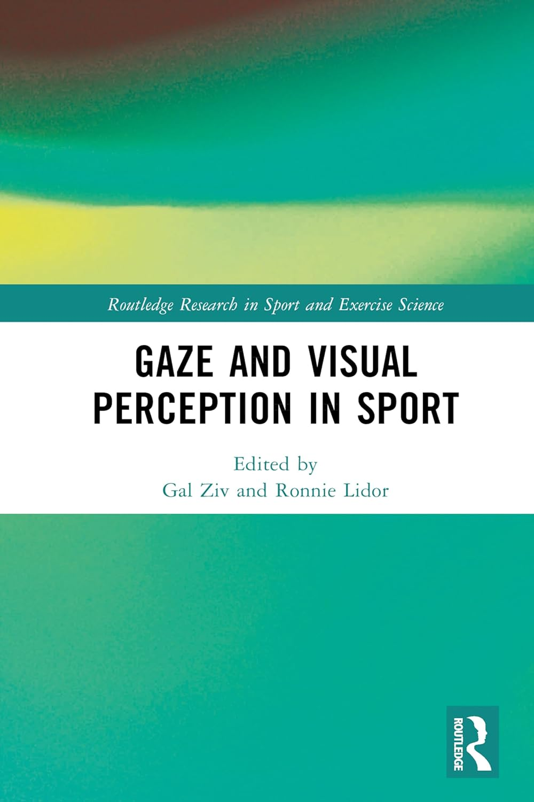

::: {.content-section}

## Book

::: {.book-card}

::: {.book-details}
### Gaze and Visual Perception in Sport

*Routledge Research in Sport and Exercise Science*

Gal Ziv & Ronnie Lidor · Routledge, 2025

[View on Amazon](https://www.amazon.com/Perception-Routledge-Research-Exercise-Science-ebook/dp/B0CXN9B81G){.book-btn target="_blank" rel="noopener" aria-label="Gaze and Visual Perception in Sport on Amazon (opens in new tab)"}
:::
:::

## Preprints

::: {.publication-year}
2026
:::

::: {.publication-item}
Danilevičiūtė, N., Mickevičienė, D., Obolski, U., & **Ziv, G.** (2026). From race car telemetry to actionable insight: An open-source toolkit for researchers and practitioners. *SportRxiv*. [https://doi.org/10.51224/SportRxiv.1068](https://doi.org/10.51224/SportRxiv.1068){target="_blank" rel="noopener" aria-label="DOI link (opens in new tab)"} · [View preprint](https://sportrxiv.org/index.php/server/preprint/view/1068/version/1320){target="_blank" rel="noopener" aria-label="View preprint on SportRxiv (opens in new tab)"} · [Code (Zenodo)](https://doi.org/10.5281/zenodo.20646625){target="_blank" rel="noopener" aria-label="Code archive on Zenodo (opens in new tab)"}
:::

## More Publications

Our lab's publications span motor learning, skill acquisition, eye-tracking, and perceptual-motor performance. For a full and up-to-date list, visit the PI's profiles:

- [Google Scholar](https://scholar.google.com/citations?user=8LstMSIAAAAJ&hl=en&oi=ao){target="_blank" aria-label="Gal Ziv on Google Scholar (opens in new tab)"}
- [ResearchGate](https://www.researchgate.net/profile/Gal-Ziv?ev=hdr_xprf){target="_blank" aria-label="Gal Ziv on ResearchGate (opens in new tab)"}

A curated publication list will be added here as the lab grows.

:::
