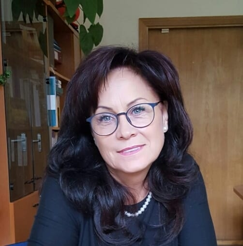

::: {.content-section}

Meet the members of the LSU Skill Acquisition Lab.

<h2 class="visually-hidden">Team Members</h2>

<h3>Gal Ziv, PhD</h3>

Principal Investigator

Associate Professor and Senior Researcher at Lithuanian Sports University. His research focuses on motor learning and skill acquisition, with particular expertise in eye-tracking studies and perceptual-motor learning in complex tasks.

<a href="https://scholar.google.com/citations?user=8LstMSIAAAAJ&hl=en&oi=ao" target="_blank" aria-label="Gal Ziv on Google Scholar (opens in new tab)">Google Scholar</a> · <a href="https://www.researchgate.net/profile/Gal-Ziv?ev=hdr_xprf" target="_blank" aria-label="Gal Ziv on ResearchGate (opens in new tab)">ResearchGate</a>

<h3>Dalia Mickevičienė, PhD</h3>

Researcher

Associate Professor at the Department of Health Promotion and Rehabilitation and Senior Researcher at the Institute of Sport Science and Innovation, Lithuanian Sports University. Her research focuses on motor control and learning and the interaction of motor skills with environmental influences.

MG

<h3>Matteo Genitrini, PhD</h3>

Researcher

Senior researcher at Lithuanian Sports University. His core expertise is Sports Biomechanics, with a special interest in technique analysis for performance improvement and injury prevention, and a growing focus on training science.

<a href="https://scholar.google.com/citations?hl=en&user=BdJuRlEAAAAJ&view_op=list_works" target="_blank" aria-label="Matteo Genitrini on Google Scholar (opens in new tab)">Google Scholar</a>

DS

<h3>Deividas Saveikis</h3>

Doctoral Student

Junior researcher at the Institute of Sport Science and Innovations, Lithuanian Sports University. His PhD research focuses on skill acquisition principles and the mechanisms by which humans learn and optimize movement in sport and everyday contexts.

ND

<h3>Neila Danilevičiūtė</h3>

Bachelor's Student

Junior specialist and research assistant at Lithuanian Sports University. A personal trainer conducting research related to motor learning, skill acquisition, and older adults' health.

:::
