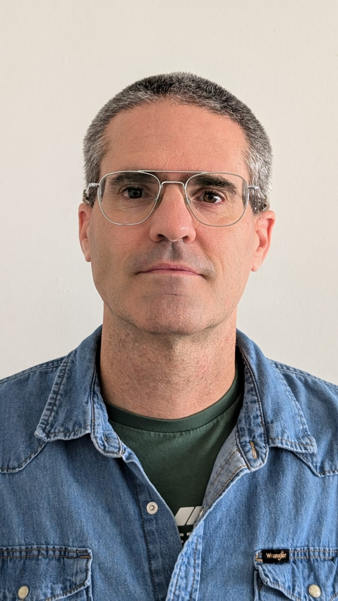

::: {.content-section}

## Our Team

Meet the members of the LSU Skill Acquisition Lab.

---

::: {.team-member}
{.team-photo}

### Gal Ziv, PhD
::: {.role}
Principal Investigator
:::

Gal Ziv is the Principal Investigator of the LSU Skill Acquisition Lab and an Associate Professor and Senior Researcher at Lithuanian Sports University. His research focuses on motor learning and skill acquisition, with particular expertise in eye-tracking studies and perceptual-motor learning in complex tasks.

[Google Scholar Profile](https://scholar.google.com/citations?user=8LstMSIAAAAJ&hl=en&oi=ao){target="_blank"} | [ResearchGate Profile](https://www.researchgate.net/profile/Gal-Ziv?ev=hdr_xprf){target="_blank"}
:::

::: {.team-member}
### Dalia Mickevičienė, PhD
::: {.role}
Researcher
:::

[Add bio here]
:::

::: {.team-member}
### Matteo Genitrini, PhD
::: {.role}
Researcher
:::

[Add bio here]

[Google Scholar Profile](https://scholar.google.com/citations?hl=en&user=BdJuRlEAAAAJ&view_op=list_works){target="_blank"}
:::

::: {.team-member}
### Deividas Saveikis
::: {.role}
Doctoral Student
:::

[Add bio here]
:::

::: {.team-member}
### Neila Danilevičiūtė
::: {.role}
Bachelor's Student
:::

Neila Danilevičiūtė is a junior specialist and research assistant at the Lithuanian Sports University, a personal trainer conducting research related to motor learning, skill acquisition, and older adults' health.
:::

:::
